<!-- BANNER ANIMADO -->
<a href="https://github.com/JhulliansForero">
  <picture>
    <source media="(prefers-color-scheme: dark)" srcset="assets/banner-dark.svg">
    <source media="(prefers-color-scheme: light)" srcset="assets/banner-light.svg">
    
  </picture>
</a>

 

---

## `$ whoami`

  

 

## `$ cat tech-stack.yaml`

<table border="1" cellpadding="14">
  <thead>
    <tr>
      <th colspan="2" align="left"><code>jhullians:~$ cat tech-stack.yaml</code></th>
    </tr>
  </thead>
  <tbody>
    <tr>
      <td width="50%" valign="top"><code>├─ ☕ backend:</code>  
         
        <code>Java 17 · Spring Boot · Maven · Python</code>
      </td>
      <td width="50%" valign="top"><code>├─ ▣ databases:</code>  
        
         
        <code>PostgreSQL · MySQL · H2 · JPA/Hibernate</code>
      </td>
    </tr>
    <tr>
      <td valign="top"><code>├─ ✦ frontend:</code>  
         
        <code>JavaScript · React · HTML · CSS · PWA</code>
      </td>
      <td valign="top"><code>╰─ ⚙ tools:</code>  
         
        <code>Git · GitHub · VS Code · Eclipse · Bash</code>
      </td>
    </tr>
  </tbody>
  <tfoot>
    <tr>
      <td colspan="2"><code>status: learning&nbsp;&nbsp;·&nbsp;&nbsp;environment: development</code></td>
    </tr>
  </tfoot>
</table>

---

## `$ ./skills --radar`

  <picture>
    <source media="(prefers-color-scheme: dark)" srcset="assets/radar-dark.svg">
    <source media="(prefers-color-scheme: light)" srcset="assets/radar-light.svg">
    
  </picture>&nbsp;
  <picture>
    <source media="(prefers-color-scheme: dark)" srcset="assets/radar-langs-dark.svg">
    <source media="(prefers-color-scheme: light)" srcset="assets/radar-langs-light.svg">
    
  </picture>

<code>signals: skill_radar · language_stack · status: compiling...</code>

---

## `$ git log --stats`

---

<!-- REDES -->
## `$ connect --socials`

 
 

Hecho con 💚, café y mucho Java · @JhulliansForero

